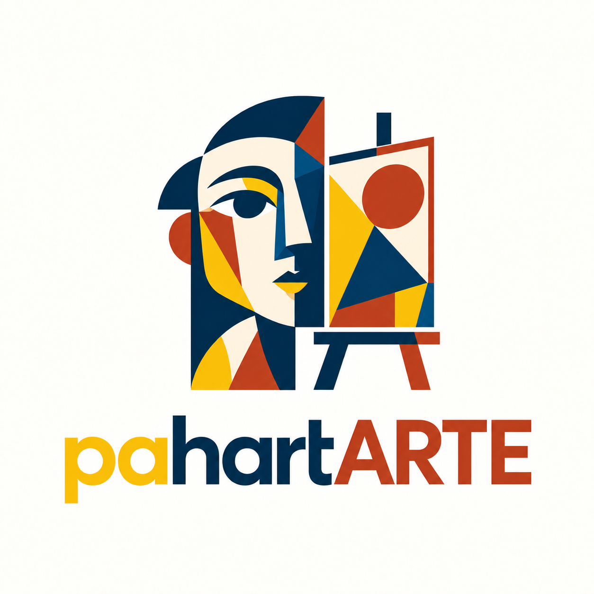

<p align="center">
  
</p>

<h1 align="center">pahartARTE</h1>
<p align="center"><strong>Pa’ hartarte de arte.</strong></p>
<p align="center">Un espacio para mostrar tu obra, descubrir artistas y dar el siguiente paso con tu arte.</p>

## El proyecto

pahartARTE es un proyecto intermodular de **Desarrollo de Aplicaciones Multiplataforma (DAM)**, desarrollado por **Andrés Zambrana Linares**. La propuesta nace del contacto con estudiantes de arte y de su interés por disponer de un porfolio propio desde el que también puedan ofrecer sus obras en venta o subasta.

La aplicación será una **web adaptable a ordenador y móvil**, dirigida principalmente a estudiantes de arte, artistas emergentes y personas interesadas en sus creaciones.

## Estado actual

El proyecto se encuentra en la fase de diseño y anteproyecto. Este repositorio contiene plantillas en HTML, CSS y JavaScript, vistas previas e identidad visual.

**Todavía no hay una aplicación React ni una API implementadas.** Las interacciones de las plantillas son demostraciones locales: no hay cuentas reales, persistencia, compras ni pujas conectadas a una base de datos.

| Disponible | Previsto para el desarrollo |
| --- | --- |
| Identidad visual y paleta de colores | Registro e inicio de sesión |
| Perfil personal y perfil de otro artista | Edición y almacenamiento del perfil |
| Pantallas Todos, Obras, Subastas, En venta y estado vacío | Publicación y gestión de obras |
| Vistas de ordenador y móvil con tamaños homogéneos | Solicitudes de compra y seguimiento de su estado |
| Plantillas con estilos compartidos | Subastas con pujas y cierre en el servidor |

## Tecnologías propuestas

La propuesta aprovecha los lenguajes ya estudiados. La elección queda pendiente de la decisión final del autor.

| Parte | Lenguajes | Tecnología |
| --- | --- | --- |
| Interfaz web | JavaScript, HTML y CSS | React y Vite |
| API | Java | Spring Boot y Spring Web |
| Persistencia | SQL | MySQL, Spring Data JPA y Hibernate |
| Acceso y permisos | Java | Spring Security |
| Gestión del código | — | Git y GitHub |
| Publicación de la interfaz | — | Cloudflare, servicio por concretar |

El alojamiento de la API Java y de MySQL se decidirá por separado. Publicar los archivos de la interfaz en Cloudflare no ejecuta por sí solo una API Spring Boot.

La justificación, el encaje con Cloudflare y el orden de aprendizaje están en la [propuesta tecnológica](documentos/propuesta-tecnologica.md).

## Primera versión prevista

- Crear una cuenta, iniciar sesión y gestionar el perfil propio.
- Mostrar un porfolio público y enlaces a Instagram y Behance.
- Publicar, editar y retirar obras con imagen y descripción.
- Consultar obras y filtrar por tipo de publicación.
- Ofrecer una obra a precio fijo y registrar una solicitud de compra.
- Crear subastas sencillas, aceptar pujas válidas y determinar el ganador al finalizar.

El primer alcance contempla solicitudes y estados de venta **sin cobros integrados**. Una pasarela de pago en modo de pruebas sería una ampliación posterior; no se presenta como un sistema de pagos reales ya disponible.

## Ver las plantillas

1. Descarga el repositorio o clónalo:

   ```bash
   git clone https://github.com/andreszambranalinares-stack/pahartARTE.git
   ```

2. Abre `index.html` en el navegador para recorrer las pantallas.
3. Abre `vista previa/index.html` para comparar las imágenes de móvil y ordenador.

Las plantillas actuales no requieren instalar dependencias. Las instrucciones para ejecutar React y la API se incorporarán cuando existan esos módulos.

## Organización

```text
pahartARTE/
├── README.md
├── index.html
├── html/
│   ├── vista-personal/
│   └── vista-3ra-persona/
├── recursos/
│   ├── estilos.css
│   ├── app.js
│   └── imagenes/
├── vista previa/
│   ├── vista personal/
│   │   ├── vista movil/
│   │   └── vista pc/
│   └── vista 3ra persona/
│       ├── vista movil/
│       └── vista pc/
└── documentos/
```

## Identidad visual

El nombre juega con la expresión andaluza **«pa’ hartarte»** y la palabra **ARTE**. Amarillo, azul y rojo conectan con el modelo artístico tradicional de colores primarios.

| Uso | Color |
| --- | --- |
| Amarillo de marca | `#F9BE09` |
| Azul de marca | `#012C4D` |
| Rojo de marca | `#BB3E1C` |
| Crema del logotipo | `#FEF3E0` |
| Fondo de la interfaz | `#FCFAF5` |

Los colores del logotipo son una aproximación extraída del archivo con textura. Consulta la [paleta completa en PDF](documentos/paleta-colores.pdf) y los [valores en JSON](documentos/paleta-colores.json).

## Documentación y uso de IA

- [Guía para redactar el anteproyecto](documentos/guia-anteproyecto.md).
- [Propuesta tecnológica y alcance](documentos/propuesta-tecnologica.md).
- [Registro de asistencia de IA](documentos/registro-uso-ia.md).

Se ha utilizado IA como apoyo en la preparación de las plantillas, las vistas previas, la extracción de la paleta, la propuesta tecnológica, esta guía y este README. El registro detalla el alcance de esa asistencia y debe actualizarse durante el desarrollo.

La memoria académica se redactará y revisará por el autor. La ayuda de IA recibida también debe declararse si influye en la planificación o en la documentación, aunque el texto final se escriba personalmente.
